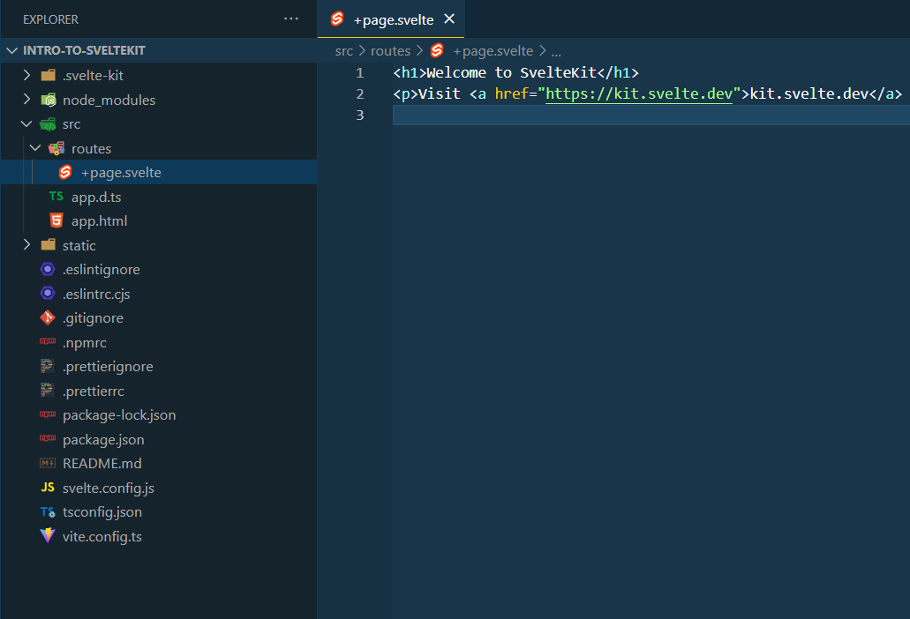
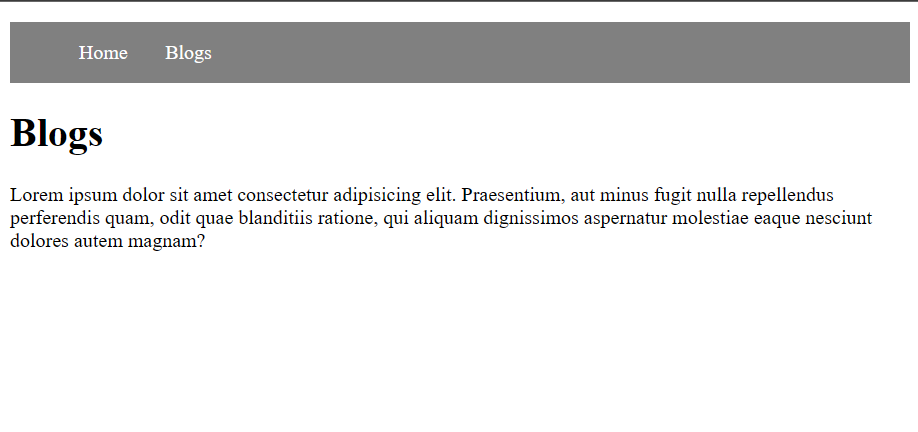
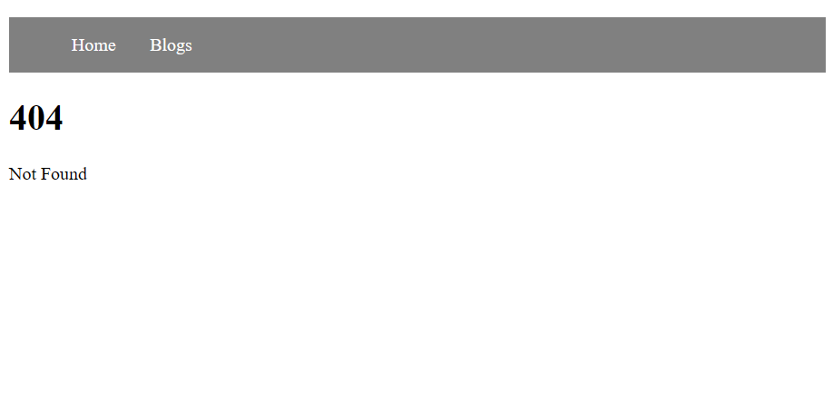

As a web developer, especially in the Javascript ecosystem you're probably familiar with or even using rendering frameworks like Next or Nuxt. Sveltekit is a similar framework catered towards Svelte users. It hit stable 1.0 last month and has generated quite the hype. I know what you're thinking, "Oh god another JS framework! Why should I learn this?" - well, let me try and convince you why Svelte/Sveltekit provides one of the best developer experience.

## Why Svelte/Sveltekit?

Sveltekit is basically used for creating webapps with Svelte. For those who are not really familiar with Svelte, it is, in a lot of ways similar, to like React or Vue. It can do almost all that React and Vue can do, but there are some fundamental differences in it's approach.

1. No Virtual DOM
This is due to Svelte being a compiled UI framework and therefore does not to do a DOM diffing at run-time. This also results in better performance on average. However, if you really care about performance there are other options out there (Solidjs is a notable one). 
2. Lower Bundle Size
Since it's a compiler, Svelte can analyse the code at build-time and only ship the parts that are used. It even removes un-used CSS from the build.
3. Built-in animations, stores, accessibility checks etc.
The built-in animations library is, in my humble opinion, criminally underutilized and underrated. These modules makes it super easy to do basic transitions and animations. Other features like stores, accessibility warnings, easing functions etc. makes svelte a more out-of-the-box experience.

Compiler centric solutions like Svelte (or Solidjs), has a unique advantage in that it can provide as many features as the core-team can possibly provide without negatively affecting the bundle sizes. Svelte leans heavily into this philosophy, improving developer experience, productivity and overall less lines of code without taking away too much control from the developer.

Coming to Sveltekit, as was said before, it is the rendering framework for Svelte users. And like Nuxt or Next it does Server-side rendering on first page-load improving SEO and on subsequent navigations it functions like a single-page-app. So how is it any different? Well, there are two notable philosophical differences between kit and other rendering frameworks:

1. Uses the Platform
   Sveltekit philosophy is to mostly use the standard HTML, CSS and JS rather than introduce too many framework-specific things. This reduces cognitive load and also makes us better web devs in the long-run. SvelteKit also encourages development patterns that help make the websites work even if JS is disabled by the end-user.
2. Serverless-first
   Sveltekit uses adapters to tune your build code to the platform you'd like to deploy to. Sveltekit officially supports a few adapters like Netlify, Vercel, Nodejs (for typical Nodejs servers), static (for SSG) and others. You can even write your own adapters.

Enough theory. Let's see how everything works and dive right in.

*Note: All the code in this blog is available [here](https://github.com/jithusnair/sveltekit-introduction).*

## Getting Started

Let's create an blog named `intro-to-sveltekit`. To create a Sveltekit app the easiest way is to use `npm create`. So lets run `npm create svelte@latest intro-to-sveltekit`  in the terminal and select "Skeleton Project" with "Typescript", "ESLint" and "Prettier" formatting enabled. It also asks if we want to install some testing suite but we'll skip those for now.

Once the project is created cd into `intro-to-sveltekit` and run `npm install` and `npm run dev`. This will start a server on `localhost:5173` and if you go to that page in browser you’ll see a basic placeholder page. Let's take a quick look at the project structure.

## Project structure

At this stage our folder structure should look something like this:



The `src` folder is the main folder of our project.
- The `routes`, as you can probably guess, mainly contain the pages and API routes. It can also include helper files and components but it is better to put those in a `src/lib` folder
- Sveltekit encourages the use of `lib` folder (not shown in the above image) inside `src` folder (in other words `src/lib`) to contain utilities and components. Sveltekit has provided an alias "$lib" for this `lib` folder out of the box to make the import statements shorter and easier.
- `app.html` is our page template with some sveltekit specific placeholders.
- `static` folder - static assets (images, favicons etc.) go in here.

There are other files and folders in sveltekit like `error.html`, `hooks.ts`, `src/params` etc. But for now, lets focus on `routes`.

## Basics of routing

For our blog we'll first need two pages - Home and Blog.  For the home page, let's edit `routes/+page.svelte` file:

```svelte
<!-- routes/+page.svelte -->

<h1> Welcome </h1>
<p> Lorem ipsum dolor sit amet consectetur adipisicing elit. Praesentium, aut minus fugit nulla repellendus perferendis quam, odit quae blanditiis ratione, qui aliquam dignissimos aspernatur molestiae eaque nesciunt dolores autem magnam? </p>
```

And create a new `routes/blog/+page.svelte`

```svelte
<!-- routes/blog/+page.svelte -->

<h1> Blogs </h1>
<p> Lorem ipsum dolor sit amet consectetur adipisicing elit. Praesentium, aut minus fugit nulla repellendus perferendis quam, odit quae blanditiis ratione, qui aliquam dignissimos aspernatur molestiae eaque nesciunt dolores autem magnam? </p>
```

You might have noticed that the file names are a bit different. This is because Sveltekit enforces a few naming styles for our routes. To tell sveltekit that a file is a page, we use `+page.svelte`. In the above case, since the `+page.svelte` is inside `blog` folder, sveltekit understands that `blog/+page.svelte` is the file to be used to render /blog page.

If we creating files in routes that are not page-specific, sveltekit will not generate routes for them. Meaning, if we create a file `routes/blog/some-component.svelte`. Sveltekit ***will not*** generate /blog/some-component page. However, this means we can place some of our components within routes. Usually page specific components are placed in route folders. If you need to re-use such components in more than one page, it is better to put them in "$lib" (`src/lib`). 

There are other 'special files' - namely, `+layout.svelte`, `+layout.ts`, `+server.ts` etc. We'll look into 
a few of these in the coming sections.

## Layouts

We have our pages, but now we need a way to navigate between them. One way is to include the `<nav></nav>` mark-up in both of the pages we have. But that's certainly not a scalable solution. Instead we can make use of a `+layout.svelte` file - let's create one.

```svelte
<!-- routes/+layout.svelte -->

<nav> 
	<ul> 
		<li> 
			<a href="/">Home</a> 
		</li> 
		<li> 
			<a href="/blogs">Blogs</a> 
		</li> 
	</ul> 
</nav>

<!-- 
	For those unfamiliar with svelte - css in svelte files do not leak outside the component and works similar to vue's "scoped" attribute by default.
-->
<style>
	nav { 
		background-color: beige; 
	} 
	
	ul { 
		display: flex; 
	} 
	
	li {
		list-style: none; margin: 15px; 
	} 
	
	a { 
		text-decoration: none; color: black; 
	} 
</style>
```

Our app should look something like:



With `+layout.svelte` our navigation header is always visible and clicking Home or Blog only replaces the rest of the markup. Anchor tags in Sveltekit by-default works similar to `<router-link></router-link>` and doesn't do a full page reload. This behaviour can also be changed using some [special attributes](https://kit.svelte.dev/docs/link-options).

All routes inherit the layout-markup by default and can also be nested - meaning, we can have another `routes/blog/+layout.svelte` with some other special markup and `routes/blog/*` pages will inherit that both layouts' markup. The inheritance behaviour can be [customized](https://kit.svelte.dev/docs/link-options) of course.

Keen eyed amongst you might have noticed a `<slot></slot>` tag in the above markup. This is a required tag in `+layout.svelte` files. The slot tag is used to tell sveltekit that the Home-page or Blog-page markup (in our case) should go above or below `<nav></nav>` element. If we omit the `slot` sveletkit won't render the pages at all and will only show the layout-markup.

Now that we have the basic pages and navigation setup, let's replace the placeholder texts from Blogs page with a list of blogs from database.

## Loading Data

For the database and data, for now let's create an in-memory-database of sorts using some mock-movie data.

```typescript
// src/lib/database.ts

export interface Blog {
  id: string;
  title: string;
  synopsis: string;
}

export const posts = [
  {
    id: 'd98c2457-eccd-4c1e-b389-77acf50cd26d',
    title: 'Can Mr. Smith Get to Washington Anymore?',
    synopsis: `<p>The film follows Jeff Smith from inside his campaign during his bid to win the Democratic primary for the House seat of Representative Dick Gephardt, who announced his retirement. Smith, a 29-year-old teacher with no political experience, decided to run for the seat against 10 other Democratic candidates including Russ Carnahan, a member of the Carnahan political family. He was instantly dismissed by pundits who saw him as a no-name candidate due to his lack of political expertise and the presence of a Carnahan in the race.</p>
    <p>Smith's campaign begins to gain more support as he mobilizes a large grassroots political campaign. He earns the endorsement of Howard Dean at one of his speaking events, and his campaign cuts into Carnahan's initial 30-point lead. Smith, however, loses the campaign by fewer than 2,000 votes.</p>`
  },
  {
    id: 'd98c2457-eccd-4c1e-b389-77acf50cd26d',
    title: 'Affair in Trinidad',
    synopsis: `<p>When nightclub performer Chris Emery (Rita Hayworth) discovers that her husband has been murdered, she resolves to help the police find his killer. Soon she is caught between two men -- her late husband's friend Max Fabian (Alexander Scourby) and her brother-in-law, Steve (Glenn Ford), who begins his own investigation into his sibling's death. As evidence begins to point to Max as the killer, Chris finds herself in an increasingly dangerous situation.</p>`
  },
  {
    id: 'd98c2457-eccd-4c1e-b389-77acf50cd26d',
    title: 'Where a Good Man Goes (Joi gin a long)',
    synopsis: `<p>A former triad boss is just released from a Macau prison and ends up in a small inn runs by a simple and honest widow. He quickly goes back to his harsh and brutal lifestyle trying to regain his position of respect in the underworld treating everyone including the innkeeper like his servant. Though she is treated harshly, her inner strength and honesty start to work on the ex-con and when her business is threatened he tries to come to her rescue.</p>`
  },
  {
    id: 'de627d98-864f-4a8d-81dc-11d3b2850bc9',
    title: 'Basic Instinct',
    synopsis: `<p>Dantes is imprisoned on the island prison of Chateau d'If for 13 years, where he plots revenge against those who betrayed him. With help from another prisoner, he escapes the island and proceeds to transform himself into the wealthy Count of Monte Cristo as part of his plan to exact revenge.</p>`
  }

];
```

We now need to load this data on blogs page. There are a few ways to do this, but for now let's  create a load function in `routes/blogs/+page.server.ts`.

```typescript
// routes/blogs/+page.server.ts

import { blogs } from '$lib/database';

import type { Blog } from '$lib/database';
import type { PageServerLoad } from './$types';

type BlogsData = Omit<Blog, 'synopsis'>;

export const load: PageServerLoad = async () => {
  // Let's pretend that this is a network call to a database
  // that takes 2 seconds.
  const aFakeNetworkCall: Promise<BlogsData[]> = new Promise((resolve) => {
    setTimeout(() => {
      const mappedBlogData = blogs.map((blog) => {
        return {
          id: blog.id,
          title: blog.title
        } as BlogsData;
      });
      resolve(mappedBlogData);
    }, 2000);

  });
  
  return {
    blogs: await aFakeNetworkCall
  };
};
```

Let's break-down what's going on here. If a `+page.svelte` is accompanied by `+page.server.ts` which exports a `load` function, sveltekit runs the function, awaits the result *before* it renders the page. In our case we mimic a network call using a `setTimeout` function to demonstrate the 'awaiting' nature of page-load. Once the promise is resolved we return the list of blog data with just their `id` and `title`.

A small note for typescript users - the `./$types` is just a syntactic sugar for a types module that is  automatically generated by sveltekit for each pages and endpoints which we can use for type-safety.

As mentioned above, there are other ways to load the data and one of them is `+page.ts`.  The difference between this and `+page.server.ts` is that the load function in `+page.ts` runs in both client-size and server-side. But `+page.server.ts` runs the load function in the server only. So, if you have sensitive data-processing requirements, `+page.server.ts` is the best option to load the page-specific data.
 
Let's now explore how to access this data we get from load function in `blogs.svelte` and display it.

## Display Page-Load Data

Let's modify our `blog.svelte` a bit:

```svelte
<!-- routes/blogs/+page.svelte -->

<script lang="ts">
  import type { PageServerData } from './$types';

  export let data: PageServerData;
</script>

<h1>Blogs</h1>

<div class="container">
  {#each data.blogs as blog}
    <a href={`/blogs/${blog.id}`}>
      {blog.title}
    </a>
  {/each}
</div>

<style>
  .container {
    display: flex;
    flex-direction: column;
    row-gap: 1rem;
  }
</style>
```

When we provide the `data` prop (*export let variable_name* is the syntax used by svelte to declare component props and in this case the pages are essentially svelte-components) for the page, svelte injects the load-function's data (in our case, the blog data) to the `data` prop. This data is then used in svelte's `{#each}{/each}` syntax to loop and display the links to each of the blog pages. 

As noted before, the types from "./$types" automatically gives us type-safety.

Our blog page should now look something like below:


If you try and navigate from Home page to Blogs page, you can see that the page will not be rendered until the load function returns data. You can increase the `setTimeout` duration in the load-function and observe this behaviour clearly.

We have successfully rendered the blogs page dynamically. We now need to render each blog page. Let's do that next.

## Params and Blog Page

To render our blog page we need a REST-like `/blogs/:blog_id` page. To do that in Sveltekit, we can create a file in `routes/blogs/[blogId]`.

```svelte
<!-- routes/blogs/[blogId]/+page.svelte -->

<h1> This is a blog-page </h1>
```

We can now click on one of the links in the `/blogs` page and we should land on this page with the dummy text.

Of course, the dummy text won't work for us and we need to load the blog-data. We can repeat the process we did for blogs page and use load function to fetch the data. Let's create a `+page.server.ts` file.

```typescript
// routes/blogs/[blogId]/+page.server.ts
import { error } from '@sveltejs/kit';
import { blogs } from '$lib/database';

import type { Blog } from '$lib/database';
import type { PageServerLoad } from './$types';

export const load: PageServerLoad = async (event) => {
  const { params } = event;
  // Let's pretend that this is a network call to a database
  // that takes 2 seconds.
  const aFakeNetworkCall: Promise<Blog> = new Promise((resolve, reject) => {
    setTimeout(() => {
      const blogData = blogs.find((blog) => params.blogId === blog.id);
      if (blogData) resolve(blogData);
      else reject('Not Found');
    }, 2000);
  });

  try {
    const blog = await aFakeNetworkCall;
    return {
      blog
    };
  } catch (loadError) {
    if (loadError === 'Not Found') throw error(404, 'Not Found');
    
		throw error(500, 'Something went wrong. Please try again.');
  }
};
```

This is similar to our `routes/blogs/+page.server.ts` except for some minor differences. Sveltekit provides a params object for our load function and we use it here to find our blog's id (in other words `params.blogId` gives us our `[blogId]`). 

If the blog is not found in our database we throw an Sveltekit-specific-error. This error function is used to catch errors we *expect*. When such an error is thrown, Sveltekit goes up the route folders and renders the nearest `+error.svelte`. This is a special Sveltekit-route-file that's used to render such expected errors. We haven't created such a file in our app and in such cases Sveltekit renders a default error page.

With our load function done, we now need to display the data in `[blogId]` page. Let's remove our dummy text in `[blogId]` page and use our load-data just like we did for blogs-page:

```svelte
<!-- routes/blogs/[blogId]/+page.svelte -->

<script lang="ts">
  import type { PageServerData } from './$types';
  
  export let data: PageServerData;
</script>

<h1>
  {data.blog.title}
</h1>

<!-- This is the svelte syntax to render the given data as HTML -->
{@html data.blog.synopsis}
```

That's it! 

Let's click on one of our blog-links in the `/blogs` page.


It works! Now let's see what happens if we try a blog Id that doesn't exist - say `blogs/123`.



The above page is created by Sveltekit because we don't have a custom `+error.svelte` page. 

## Conclusion

We have successfully built a blog app in Sveltekit. We have only scratched the surface of what's possible though, but I hopefully I've been able to convince you how fun Svelte/Sveltekit development can be. 

If you'd like to go beyond this introduction and learn how to handle forms, per-user-state, errors or other advanced topics, I'd recommend [Sveltkit documentation](https://kit.svelte.dev/docs/introduction) or their new [interactive tutorial](https://learn.svelte.dev/tutorial/welcome-to-svelte) (the latter is a work-in-progress though).